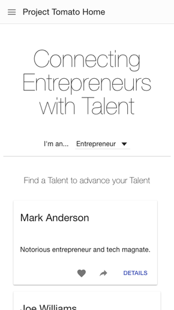
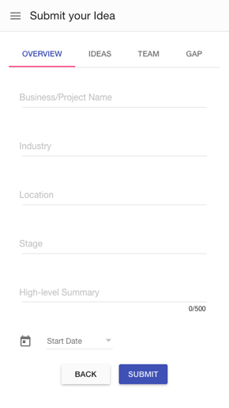

# Angular Material Demo App

## Screenshot

### Desktop:


### Mobile:




## Prerequisites

1. Node.js >= v4.4.5
2. Bower >= 1.7.9
3. Ruby: test with `ruby -v` in your terminal
4. Compass >= 1.0.3: When you've confirmed you have Ruby installed, run
`gem install compass` to install Compass

## Running the App

```bash
$ git clone https://github.com/jchen86/angular-material-demo.git
$ cd angular-material-demo
$ npm install & bower install
$ npm start
```
> Open browser and go to [localhost:9000](localhost:9000)

## Running the tests

Running `grunt test` will run the unit tests with karma.
